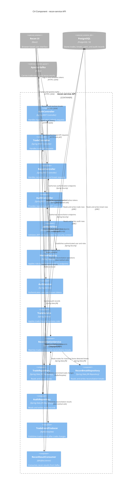

# TICKET-ADV004 - C4 Component Diagram

```mermaid
C4Component
    title C4 Component - recon-service API

    Container_Ext(ui, "Recon UI", "React", "Browser-based user interface")
    ContainerDb_Ext(postgres, "PostgreSQL", "PostgreSQL 16", "Stores trades, breaks, users, and audit records")
    ContainerQueue_Ext(kafka, "Apache Kafka", "Kafka", "Carries trade-events and recon-results")

    Container_Boundary(apiBoundary, "recon-service API") {
        Component(authController, "AuthController", "Spring REST Controller", "Handles login and token refresh requests")
        Component(tradeController, "TradeController", "Spring REST Controller", "Handles trade API requests")
        Component(reconController, "ReconController", "Spring REST Controller", "Handles reconciliation and break requests")
        Component(auditController, "AuditController", "Spring REST Controller", "Provides read-only audit API requests")

        Component(jwtAuthFilter, "JwtAuthFilter", "OncePerRequestFilter", "Validates JWTs and populates the security context")
        Component(methodSecurity, "MethodSecurity", "Spring Security", "Applies role-based authorization to endpoints")

        Component(authService, "AuthService", "Spring Service", "Authenticates users and issues tokens")
        Component(tradeService, "TradeService", "Spring Service", "Applies trade lifecycle business rules")
        Component(reconciliationService, "ReconciliationService", "Spring Service", "Matches trades and detects reconciliation breaks")

        Component(tradeRepository, "TradeRepository", "Spring Data JPA Repository", "Reads and writes trades")
        Component(reconBreakRepository, "ReconBreakRepository", "Spring Data JPA Repository", "Reads and writes reconciliation breaks")
        Component(auditRepository, "AuditRepository", "Spring Data JPA Repository", "Reads and writes audit records")

        Component(tradeEventProducer, "TradeEventProducer", "KafkaTemplate", "Publishes trade-events after trade changes")
        Component(reconResultConsumer, "ReconResultConsumer", "@KafkaListener", "Consumes recon-results from Kafka")
    }

    Rel(ui, jwtAuthFilter, "Sends authenticated API requests", "HTTPS with JWT")
    Rel(ui, authController, "Logs in and refreshes tokens", "HTTPS / JSON")
    Rel(ui, tradeController, "Creates and queries trades", "HTTPS / JSON")
    Rel(ui, reconController, "Reviews and resolves breaks", "HTTPS / JSON")
    Rel(ui, auditController, "Reads audit history", "HTTPS / JSON")

    Rel(jwtAuthFilter, methodSecurity, "Establishes authenticated user and roles", "Spring Security")
    Rel(methodSecurity, authController, "Authorizes authentication endpoints", "Spring Security")
    Rel(methodSecurity, tradeController, "Authorizes trade endpoints", "Spring Security")
    Rel(methodSecurity, reconController, "Authorizes reconciliation endpoints", "Spring Security")
    Rel(methodSecurity, auditController, "Authorizes audit endpoints", "Spring Security")

    Rel(authController, authService, "Authenticates users and refreshes tokens", "Java method calls")
    Rel(tradeController, tradeService, "Executes trade operations", "Java method calls")
    Rel(reconController, reconciliationService, "Executes reconciliation operations", "Java method calls")
    Rel(auditController, auditRepository, "Queries audit records", "Spring Data JPA")

    Rel(authService, auditRepository, "Records authentication events", "Spring Data JPA")
    Rel(tradeService, tradeRepository, "Reads and writes trades", "Spring Data JPA")
    Rel(tradeService, tradeEventProducer, "Publishes committed trade changes", "KafkaTemplate")
    Rel(reconciliationService, tradeRepository, "Reads trades for matching", "Spring Data JPA")
    Rel(reconciliationService, reconBreakRepository, "Stores detected breaks", "Spring Data JPA")
    Rel(reconResultConsumer, reconciliationService, "Processes reconciliation results", "Java method calls")

    Rel(tradeRepository, postgres, "Reads and writes trade rows", "JDBC")
    Rel(reconBreakRepository, postgres, "Reads and writes break rows", "JDBC")
    Rel(auditRepository, postgres, "Reads and writes audit rows", "JDBC")

    Rel(tradeEventProducer, kafka, "Publishes trade-events", "Kafka protocol")
    Rel(kafka, reconResultConsumer, "Delivers recon-results", "Kafka protocol")
```
