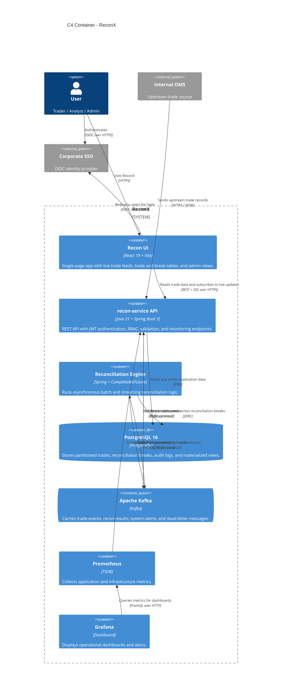

# TICKET-ADV003 - C4 Container Diagram

```mermaid
C4Container
    title C4 Container - ReconX

    Person(user, "User", "Trader / Analyst / Admin")
    System_Ext(oms, "Internal OMS", "Upstream trade source")
    System_Ext(sso, "Corporate SSO", "OIDC identity provider")

    System_Boundary(reconxBoundary, "ReconX") {
        Container(ui, "Recon UI", "React 19 + Vite", "Single-page app with live trade feeds, trade and break tables, and admin views.")
        Container(api, "recon-service API", "Java 21 + Spring Boot 3", "REST API with JWT authentication, RBAC, validation, and monitoring endpoints.")
        Container(engine, "Reconciliation Engine", "Spring + CompletableFuture", "Runs asynchronous batch and streaming reconciliation logic.")
        ContainerDb(db, "PostgreSQL 16", "PostgreSQL", "Stores partitioned trades, reconciliation breaks, audit logs, and materialized views.")
        ContainerQueue(kafka, "Apache Kafka", "Kafka", "Carries trade-events, recon-results, system-alerts, and dead-letter messages.")
        Container(prometheus, "Prometheus", "TSDB", "Collects application and infrastructure metrics.")
        Container(grafana, "Grafana", "Dashboard", "Displays operational dashboards and alerts.")
    }

    Rel(user, ui, "Uses ReconX", "HTTPS")
    Rel(user, sso, "Authenticates", "OIDC over HTTPS")
    Rel(ui, sso, "Redirects users for login", "OIDC over HTTPS")
    Rel(ui, api, "Reads trade data and subscribes to live updates", "REST + SSE over HTTPS")

    Rel(oms, api, "Sends upstream trade records", "HTTPS / JSON")
    Rel(api, db, "Reads and writes application data", "JDBC")
    Rel(api, kafka, "Publishes trade events", "Kafka protocol")
    Rel(kafka, api, "Delivers trade events", "Kafka protocol")

    Rel(engine, db, "Reads trades and writes reconciliation breaks", "JDBC")
    Rel(kafka, engine, "Delivers trade events for reconciliation", "Kafka protocol")
    Rel(engine, kafka, "Publishes reconciliation results", "Kafka protocol")

    Rel(prometheus, api, "Scrapes application metrics", "HTTPS")
    Rel(grafana, prometheus, "Queries metrics for dashboards", "PromQL over HTTP")
```