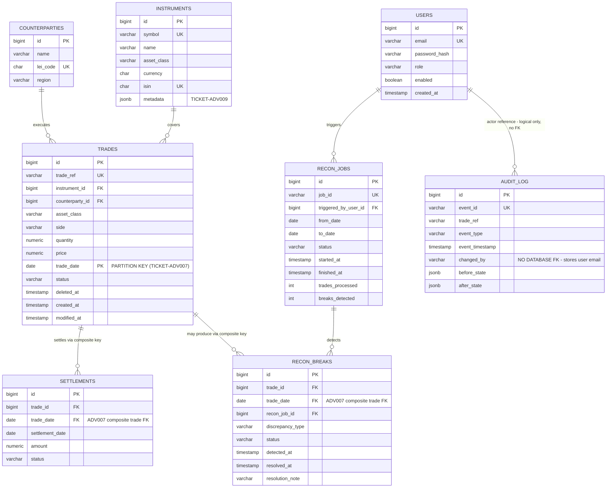

# TICKET-ADV006 - ER Model (8 Entities)

```mermaid
erDiagram
    COUNTERPARTIES ||--o{ TRADES : "executes"
    INSTRUMENTS ||--o{ TRADES : "covers"
    TRADES ||--o{ SETTLEMENTS : "settles via composite key"
    TRADES ||--o{ RECON_BREAKS : "may produce via composite key"
    RECON_JOBS ||--o{ RECON_BREAKS : "detects"
    USERS ||--o{ RECON_JOBS : "triggers"
    USERS ||--o{ AUDIT_LOG : "actor reference - logical only, no FK"

    COUNTERPARTIES {
        bigint id PK
        varchar name
        char lei_code UK
        varchar region
    }

    INSTRUMENTS {
        bigint id PK
        varchar symbol UK
        varchar name
        varchar asset_class
        char currency
        char isin UK
        jsonb metadata "TICKET-ADV009"
    }

    USERS {
        bigint id PK
        varchar email UK
        varchar password_hash
        varchar role
        boolean enabled
        timestamp created_at
    }

    TRADES {
        bigint id PK
        varchar trade_ref UK
        bigint instrument_id FK
        bigint counterparty_id FK
        varchar asset_class
        varchar side
        numeric quantity
        numeric price
        date trade_date PK "PARTITION KEY (TICKET-ADV007)"
        varchar status
        timestamp deleted_at
        timestamp created_at
        timestamp modified_at
    }

    SETTLEMENTS {
        bigint id PK
        bigint trade_id FK
        date trade_date FK "ADV007 composite trade FK"
        date settlement_date
        numeric amount
        varchar status
    }

    RECON_JOBS {
        bigint id PK
        varchar job_id UK
        bigint triggered_by_user_id FK
        date from_date
        date to_date
        varchar status
        timestamp started_at
        timestamp finished_at
        int trades_processed
        int breaks_detected
    }

    RECON_BREAKS {
        bigint id PK
        bigint trade_id FK
        date trade_date FK "ADV007 composite trade FK"
        bigint recon_job_id FK
        varchar discrepancy_type
        varchar status
        timestamp detected_at
        timestamp resolved_at
        varchar resolution_note
    }

    AUDIT_LOG {
        bigint id PK
        varchar event_id UK
        varchar trade_ref
        varchar event_type
        timestamp event_timestamp
        varchar changed_by "NO DATABASE FK - stores user email"
        jsonb before_state
        jsonb after_state
    }
```
